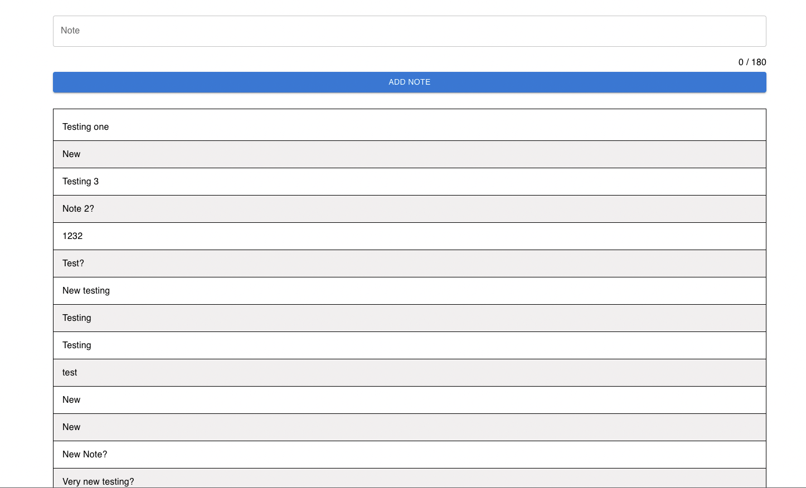
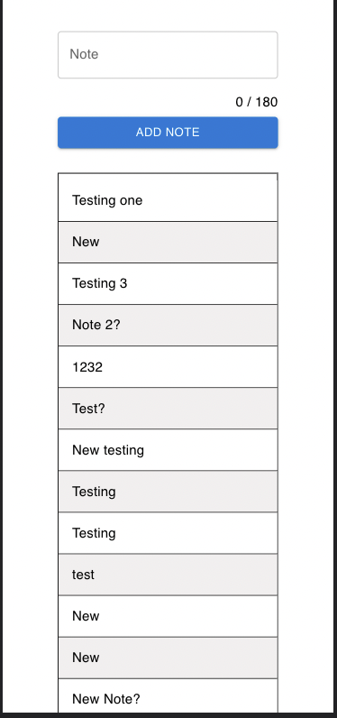

## Available Scripts

In the project directory, you can run:

### `yarn start`

Runs the app in the development mode.\
Open [http://localhost:3000](http://localhost:3000) to view it in the browser.

The page will reload if you make edits.\
You will also see any lint errors in the console.

### `yarn test`

Launches the test runner in the interactive watch mode.\
See the section about [running tests](https://facebook.github.io/create-react-app/docs/running-tests) for more
information.

### `yarn build`

Builds the app for production to the `build` folder.\
It correctly bundles React in production mode and optimizes the build for the best performance.

The build is minified and the filenames include the hashes.\
Your app is ready to be deployed!

See the section about [deployment](https://facebook.github.io/create-react-app/docs/deployment) for more information.

## Technical Decisions

This section will summarise most of the major decisions that I made while executing this task.

### Use Redux Toolkit

Although we don't have many components, pages yet to share the state with. I decided to use Redux in order to share the
notes list and dispatch different methods in a centralised way.
One of the reasons of doing so is not to re-fetch data when adding a new note and just pushing it the notes list, so
less calls to the backend on a successful insert.

### No pagination

I was planning on building some sort of pagination for the notes list. However, normally the logic of pagination is
built on the backend by returning some sort of meta data, for example:

```
{
    "meta": {
        "total": 40,
        "has_next": true,
        "page": 1
    }
}
```

which can be easily used on the frontend. For now, I am just showing all of the notes on the page.

### No Automated Tests

This is a bad decision, but due to time constraint, I made sure to deliver something that is working based on manual
tests that I did.
Ideally in a new project I follow TDD while building the project. But for this project the MUI part needed some
experimenting so it took some time.

### Cases to cover

The implementation is an optimistic one. This means that it is just covering the happy when calling the backend. In the
real world it should cover both cases.

### Not use `useQuery` and `useMutation`

As you might have noticed, I am creating a singleton client instead of using the hooks above. The reasoning behind that
is that I am calling
the grapqhl queries/mutations in the thunk in the store, which is outside a functional component, which made it not
possible to be called from there.

### Inline styling

Ideally, it is recommended to have styling in its own file, but due to experimenting and time limits, I kept as inlined.

### Use .env

It is a good practice to keep configuration values in a `.env` file. For now it is just used for the URL of the backend
graphql service.
I am pushing the `.env` file to remote just to be able to run the code but ideally, files with secrets are not pushed as
plain text to git.

## Screenshots

### Web view



### Mobile view



## Testing

Happy path is tested:

1. Add a new note
2. List previous notes
3. A note doesn't exceed 180 characters.
4. Validation check when the submit button is clicked.
5. Integration with backend.
